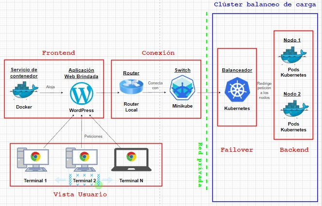

# Balanceador de carga y Failover

## Integrantes

* Denisse Cumbal
* Daniel Guachamín
* Jeremy León
* Cindy Yazán

## Acerca del proyecto

<div align="center">
    
</div>

El proyecto consiste en el diseño, implementación y cotización de un balanceador de carga y failover. 

Se presenta una página en WordPress alojada en varios nodos de un cluster de kubernetes para el acceso de usuarios a la aplicación de WordPress. Además, se llevará a cabo una falla de uno de los servidores o nodos para que kubernetes (el orquestador) levante un nuevo servidor automáticamente.

## Arquitectura

Se presenta el diseño de la arquitectura que se ha seguido para llevar a cabo el proyecto

<div align="center">
    
</div>

## Configuración

Con todos los archivos del repositorio es posible levantar el servicio que aloja la aplicación de WordPress con el comando 
```sh
   kubectl port-forward svc/wordpress 8001:8001
   ```
Se puede verificar la aplicación en funcionamiento en el la dirección ```sh http://localhost:4200 ```

Ahora se debe configurar WordPress para crear una plantilla como se ve en las siguientes imágenes

<div align="center">
    
</div>

<div align="center">
    
</div>

<div align="center">
    
</div>

La verificación de los nodos creados se puede encontrar en el Dashboard de Kubernetes

<div align="center">
    
</div>

Se puede visualizar que los contenedores donde almacenan WordPress (frontend) y Mysql (backend) han sido creadas

<div align="center">
    
</div>

Sigue la subida de las imágenes a Docker Hub que se lo realiza desde Docker Desktop haciendo un Push to Hub.

<div align="center">
    
</div>

<div align="center">
    
</div>

Con el siguiente comando se puede observar todos los servicios levantados

<div align="center">
    
</div>

Y con este comando se puede ver los Pods o Nodos que estan corriendo y la simulación de la baja de un nodo

<div align="center">
    
</div>

<p align="right">(<a href="#top">back to top</a>)</p>

### Herramientas 

* [![Kubernetes][Kubernetes.io]][Kubernetes-url]
* [![Minikube][Minikube.io]][Minikube-url]
* [![Docker][Docker.com]][Docker-url]
* [![Wordpress][Wordpress.com]][Wordpress-url]

### Cotización 

En esta sección se presenta el costeo de precios de acuerdo a las herramientas usadas

<div align="center">
    
</div>

## Anexos

Encuentra en el siguiente link el video de la explicación técnica de la arquitectura y funcionalidad

* [Video](https://www.youtube.com/watch?v=GE5k1SXyuBo) 

También contamos con un video que explica el manual de usuario

* [Video](https://youtu.be/zkeQBD7-SFc) 

<p align="right">(<a href="#top">back to top</a>)</p>


<!-- MARKDOWN LINKS & IMAGES -->

[Kubernetes.io]: https://img.shields.io/badge/Kubernetes-326DE6?style=for-the-badge&logo=kubernetes&logoColor=white
[Kubernetes-url]: https://kubernetes.io/es/docs/concepts/workloads/pods/pod/
[Minikube.io]: https://img.shields.io/badge/Minikube-C9E9EC?style=for-the-badge&logo=minikube&logoColor=white
[Minikube-url]: https://minikube.sigs.k8s.io/docs/start/
[Docker.com]: https://img.shields.io/badge/Docker-2496ED?style=for-the-badge&logo=docker&logoColor=white
[Docker-url]: https://minikube.sigs.k8s.io/docs/start/
[Wordpress.com]: https://img.shields.io/badge/WordPress-275A70?style=for-the-badge&logo=wordpress&logoColor=white
[Wordpress-url]: https://wordpress.com/es/
